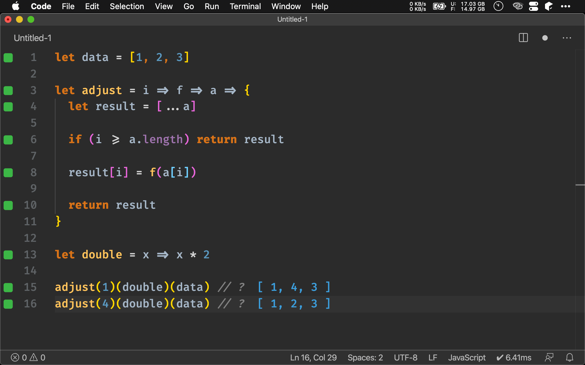
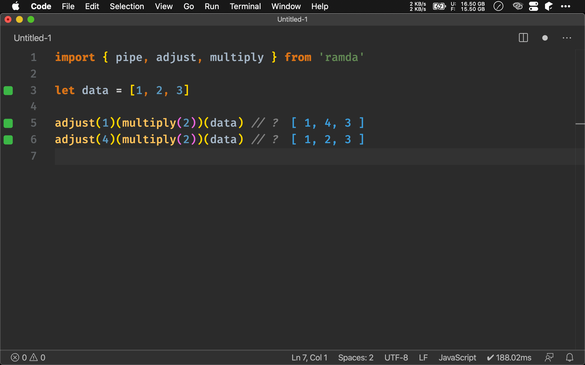
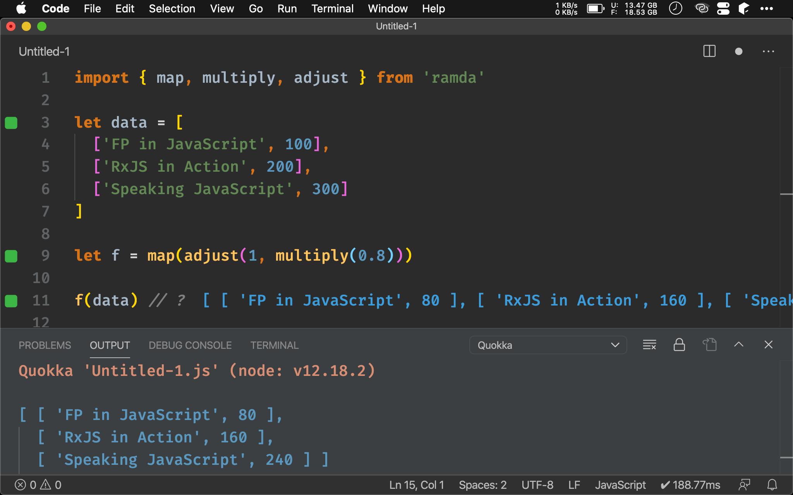

## Version

Ramda 0.27.0

## Imperative

```javascript
let data = [1, 2, 3]

let adjust = i => f => a => {
  let result = [...a]

  if (i >= a.length) return result

  result[i] = f(a[i])

  return result
}

let double = x => x * 2

adjust(1)(double)(data) // ?
adjust(4)(double)(data) // ?
```

ECMAScript 可使用 `[]` 直接修改 element，唯 index 超過 array 的 length 時會繞回去前面的 element，因此特別處理。



## adjust()

```javascript
import { pipe, adjust, multiply } from 'ramda'

let data = [1, 2, 3]

adjust(1)(multiply(2))(data) // ?
adjust(4)(multiply(2))(data) // ?
```

Ramda 已經提供 `adjust()` 可直接使用。

> **adjust()**
> `Number → (a → a) → [a] → [a]`
>
> 使用 function 改變 array 中指定 index 值

`Number`：指定 index 值

`(a -> a)`：改變 index 的 function

`[a]`：data 為 array

`[a]`：回傳改變過 array



## Pair Array

```javascript
import { map, multiply, adjust } from 'ramda'

let data = [
  ['FP in JavaScript', 100],
  ['RxJS in Action', 200],
  ['Speaking JavaScript', 300]
]

let f = map(adjust(1, multiply(0.8)))

f(data) // ?
```

ECMAScript 雖然沒有 Pair，但實務上常用 Array 模擬 Pair，如 Ramda 的 `pair()` 就是回傳只有兩個 element 的 Array。

第 3 行

```javascript
let data = [
  ['FP in JavaScript', 100],
  ['RxJS in Action', 200],
  ['Speaking JavaScript', 300]
]
```

`data` 為 Pair Array，我們希望對 price 打八折。

第 9 行

```javascript
let f = map(adjust(1, multiply(0.8)))
```

由於 Pair 本質為 Array，而 price 只是 `[1]`，剛好可使用 `multiply(0.8)`  直接對 `adjust(1)` 對 price 打八折。



## Conclusion

* `adjust()` 與 `update()` 很類似，唯 `adjust()` 傳入 function，而 `update()` 傳入 value
* `adjust()` 在實務上看似少用，但若搭配 Pair Array 就非常實用，可搭配 `map()` 改變 Pair 

## Reference

[Ramda](https://ramdajs.com), [adjust()](https://ramdajs.com/docs/#adjust)
[Kyle Tilman](http://blog.kyletilman.com), [Ramda -- R.adjust()](http://blog.kyletilman.com/2017/07/03/ramda---r-adjust/)