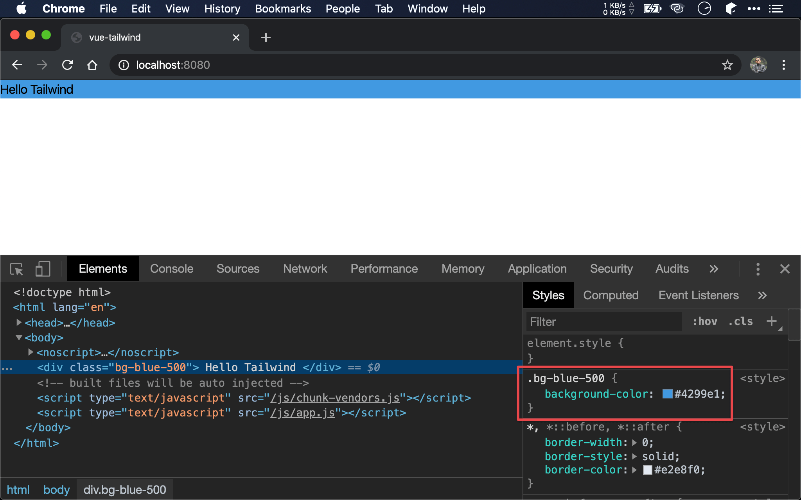

## Version

Tailwind 1.2.0

## Background Color

```html
<template>
  <div class="bg-blue-500">
    Hello Tailwind
  </div>
</template>
```

第 2 行

```html
<div class="bg-blue-500">
```

若要對整個 `<div>` 設定 background color，只要在 `<body>` 加上 `bg-` 開頭的 utility。

- `blue`：設定顏色部分
- `500`：可設定 `100` ~ `900`，數字越大表顏色越深



`bg-{color}` 本質是 CSS 的 `background-color`。

## Conclusion

* `bg-{color}` 系列 utility 讓我們可以直接對 HTML element 設定 background color，而不用另外撰寫 CSS

## Reference

[Tailwind CSS](https://tailwindcss.com), [Background Color](https://tailwindcss.com/docs/background-color)